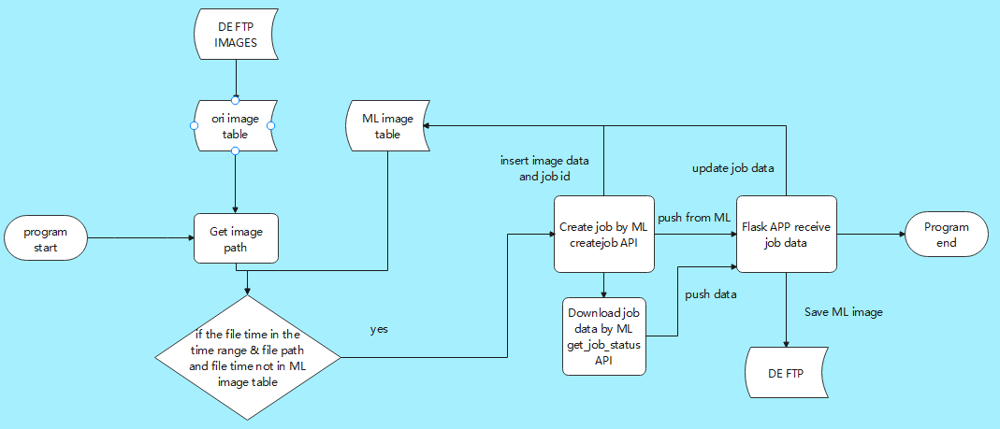

# Auto Image Measure
## 项目描述
为避免工人手动测量图片参数时的误差，开发了Auto Image Measure项目，通过API实现自动测量并输出测量值和带测量线的图片。我负责下载数据用于模型训练，定时调用API进行测量并上传数据到终端系统。还更新了PhotoQuery以支持对预测图片的查询和下载，并创建了参数检查报表用于数据分析。
## 项目职责
下载数据：大批量下载特定工序和项目的图片和人工测量数据，供API训练模型使用。
自动测量：定时调用API对新图片进行测量，获取测量值和预测图片。
数据上传：将测量数据上传到终端系统ThoughtSpot，方便用户使用和分析。
更新PhotoQuery：更新PhotoQuery，使其支持对预测图片的查询和下载。
创建报表：创建参数检查报表，展示参数异常值和空值占比，提供数据质量分析。
## 项目成果
通过Auto Image Measure项目，实现了定时自动测量和上传测量数据到终端系统，减少了人工误差。用户可直接查看预测图片的测量过程，节省了人力资源。同时创建的参数检查报表提供了数据质量分析支持，帮助用户准确评估数据并做出决策。
## 逻辑图

